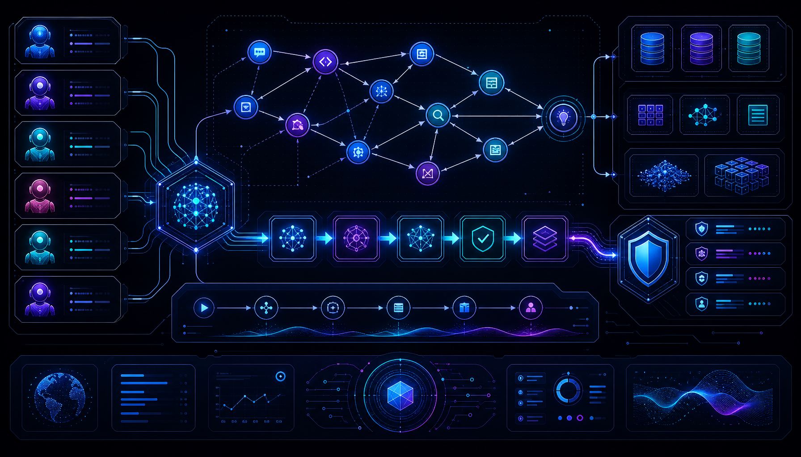

<div align="center">


# 🧬 SYMBIO

### The Next-Gen AI Infrastructure for Multi-Agent Orchestration

---

**English** | [中文](README_zh.md) | [日本語](README_ja.md)

---

**From a simple "Agent wrapper" to a self-evolving, enterprise-grade AI Infrastructure**



[](https://opensource.org/licenses/MIT)
[](https://www.python.org/downloads/)
[](https://github.com/854875058/Symbio)
[](https://github.com/854875058/Symbio)

</div>

---

## Why Symbio?

<table>
<tr>
<td width="50%">

### The Problem

- 🤖 Agent frameworks are just LLM wrappers
- 🧠 Memory is just vector search
- ⏰ Agents declare completion prematurely
- 💬 Communication costs explode exponentially
- 🔒 Security is an afterthought
- 📊 No observability, pure black box

</td>
<td width="50%">

### The Symbio Solution

- ⚡ Dynamic DAG with runtime topology evolution
- 🧬 Ontology-powered cognitive memory graph
- 🛡️ Anti-premature completion with TDD loop
- 📉 State-driven communication (-80% tokens)
- 🔐 Neuro-symbolic security firewall
- 👁️ Full OpenTelemetry observability

</td>
</tr>
</table>

---

## 🌟 Symbio Feature List (33 Killer Features)

> 与同类开源竞品拉开代差的核心特性。

### 0.1 极致离线与私有化环境存活能力 (Air-gapped & Local-First)
> 很多企业级生产环境完全隔离外网，我们原生支持"无网环境"。

- [ ] 本地大模型平滑降级 — 检测外部 API 不可用时，无缝切换到本地局域网开源模型 (vLLM / Ollama)
- [ ] 全本地依赖闭环 — 记忆系统、工具链、调度引擎在无外网状态下完整运作
- [ ] 企业内网零改造部署 — 本地调试 → 内网生产环境一键平推

### 0.2 高质量数据集自动反哺机制 (Data Flywheel)
> 系统不仅在"做任务"，还在"沉淀数据资产"。

- [ ] 轨迹捕获 — 自动记录多 Agent 协同解决任务的完整链路 (Thought → Action → Observation → Result)
- [ ] 微调数据导出 — 自动清洗并格式化为标准数据集 (ShareGPT / Alpaca 格式)
- [ ] 越跑越值钱 — 系统运行越多，沉淀的高质量语料资产越丰富

### 0.3 细粒度主动可观测性 (Agentic Observability)
> 多 Agent 协同最大痛点是"黑盒化"，我们让一切透明。

- [ ] 时空运行轨迹图 — 类似分布式链路追踪 (Trace) 的可视化状态
- [ ] 记忆快照回放 — 在任务失败节点"打断点"，恢复当时记忆状态
- [ ] Token 消耗热力图 — 可视化各 Agent/工具的 Token 消耗分布

### 0.4 动态人类介入总线 (HITL)
> 在自动化和安全性之间找到完美平衡。

- [ ] 高危动作悬挂 — SubAgent 执行高危操作时自动挂起
- [ ] IM 异步授权 — 通过微信/飞书向管理员发送授权卡片
- [ ] 审批超时策略 — 超时自动拒绝/降级执行

### 0.5 MCP (Model Context Protocol) 原生支持
> 不自己造所有轮子，原生兼容最前沿的 MCP 协议。

- [ ] 标准化工具挂载 — 零配置直接挂载让所有 SubAgent 调用
- [ ] 工具生态接入 — 天气、数据库、云资源等 MCP 工具即插即用

### 0.6 并发流控与分布式速率限制 (Rate Limiting)
> 多 Agent 系统最容易崩溃的不是代码，而是大模型 API。

- [ ] 令牌桶/漏桶算法网关 — 原生内置针对不同模型供应商的异步流控器
- [ ] 动态退避与抖动重试 — 遇到 429 时智能等待错峰重试

### 0.7 任务级"金融预算"与步数熔断 (Budget Guardrail)
> Agent 自主性是双刃剑，可能死循环烧光 API 额度。

- [ ] 硬性预算熔断 — 用户指定 max_cost_usd，超过阈值立刻挂起
- [ ] 最大步数限制 — 限制单次任务最大循环轮次，防止逻辑死循环

### 0.8 从"黑名单"到"绝对沙箱"的安全平替 (Sandbox)
> 黑名单防不住恶意或意外，需要物理隔离。

- [ ] 容器化/微型虚拟机隔离 — ShellTool 和 FileTool 原生支持运行在 Docker 容器
- [ ] 显式高危权限分级 — 工具划分为 Read-Only / Write / Execute

### 0.9 运行时状态持久化与断点续传 (Checkpoint)
> 复杂任务可能耗时数小时，中途断网/重启不能丢失进度。

- [ ] 图状态检查点 — 在关键节点将任务 DAG 状态序列化到 SQLite
- [ ] 断点唤醒 — 系统重启后一键恢复到崩溃前状态继续执行

### 0.10 自动化评测管道 (Eval Pipeline)
> 改了 A 处 Prompt，B 处 Agent 不能莫名变蠢。

- [ ] symbio eval 模块 — 编写测试集（输入任务 → 预期工具调用 → 预期输出）
- [ ] 合并前自动评测 — 代码合并前自动评估准确率

### 0.11 动态拓扑自适应与运行时重规划 (Dynamic DAG)
> 市面框架都是静态图，我们实现"兵无常势，水无常形"。

- [ ] 完全动态 DAG — 放弃预设路径，Orchestrator 只生成初始宏观步骤
- [ ] 运行时拓扑重构 — 根据中间观测结果动态增删节点、合并并行链路

### 0.12 上下文智能剪枝与 Prompt Cache 深度对齐 (Context Pruning)
> 长作业上下文膨胀导致费用飙升、注意力涣散。

- [ ] 语义剪枝 — 自动提取历史中的"决策关键点"和"状态增量"
- [ ] 缓存对齐布局 — 确保 90%+ 静态前缀持续命中 Cache

### 0.13 多代理共识辩论与交叉验证 (Multi-Agent Debate)
> 高精度任务用"算力换确定性"，消灭幻觉。

- [ ] 三家分晋机制 — Proposer 创造者、Critic 批判者、Refiner 修正者
- [ ] 多轮内生辩论 — 直到达成共识或投票决定最终输出

### 0.14 从向量到本体：长效记忆的本体化 (Ontology Memory)
> 向量检索只能找相似片段，本体理解领域概念层次与推理规则。

- [ ] Vector + Ontology 双驱动 — 长期记忆演进为向量+本体混合架构
- [ ] 语义推理 — 基于本体推理规则自动推导隐含知识

### 0.15 Prompt Injection 防护引擎 (Security Firewall)
> 目前所有 Agent 框架最大的安全盲区。

- [ ] 输入净化层 — 检测并拦截 Prompt Injection 攻击
- [ ] 输出审计层 — 审计 Agent 输出是否包含敏感信息泄露
- [ ] 意图偏离检测 — 监控 Agent 实际行为是否偏离用户原始意图

### 0.16 语义缓存 (Semantic Cache)
> 相似请求复用结果，Token 成本直接砍到零。

- [ ] 向量相似度匹配 — "帮我写个快排"和"实现快速排序算法"语义相同，结果可复用
- [ ] 与 Prompt Cache 深度整合 — 语义缓存 + 前缀缓存双重优化

### 0.17 多模态原生支持 (Multi-Modal)
> 不只是文本，图片/文档/音视频都是 Agent 的输入输出。

- [ ] 图片理解 — 截图分析、UI 审查、OCR 提取
- [ ] 文档解析 — PDF/Word/Excel 智能提取与结构化
- [ ] 音频转写 — 会议纪要、语音指令

### 0.18 分布式链路追踪 (OpenTelemetry)
> 多 Agent 系统的可观测性基础设施。

- [ ] 原生 OTel 集成 — 每个 Agent/工具调用都是一个 Span
- [ ] 对接 Jaeger/Grafana/Prometheus — 企业级监控面板开箱即用

### 0.19 Prompt 版本管理与 A/B 测试 (PromptOps)
> Prompt 是代码，需要版本控制和灰度发布。

- [ ] Prompt 版本控制 — 每次修改都有 diff、可回滚、可审计
- [ ] A/B 测试框架 — 不同 Prompt/模型的在线对比测试

### 0.20 Agent 仿真测试沙箱 (Simulation)
> 上线前在仿真环境中验证 Agent 行为。

- [ ] 场景模拟 — 模拟各种用户输入、工具失败、网络异常
- [ ] 边界行为发现 — 自动发现 Agent 的死循环、幻觉、越权操作

### 0.21 项目级隔离与多租户 (Project Isolation)
> 每个项目独立的记忆、配置、维护，互不干扰。

- [ ] 项目级记忆隔离 — 每个项目拥有独立的 LanceDB 表和本体图谱
- [ ] 项目级配置隔离 — 每个项目独立的模型选择、工具权限、安全策略

### 0.22 内置预制 Agent 与 Skills 仓库 (Skills Marketplace)
> 开箱即用的预制 Agent，社区共建的 Skills 生态。

- [ ] 预制 Agent 库 — UI 设计 Agent、代码审查 Agent、数据分析 Agent 等
- [ ] Skills 仓库 — 官方维护的 Skills 市场，社区贡献与共享

### 0.23 前沿协议与标准兼容 (Cutting-Edge Protocols)
> 站在巨人肩膀上，兼容最前沿的行业标准。

- [ ] Agent-to-Agent (A2A) 协议 — 与 Google ADK、CrewAI 等外部 Agent 互通
- [ ] Structured Output — JSON Schema 强制约束 LLM 输出格式
- [ ] Computer Use — 屏幕截图 → 视觉理解 → GUI 操控闭环

### 0.24 防过早完成与测试驱动闭环 (Anti-Premature Completion)
> 从根源解决"代理过早宣布完成"的行业顽疾。

- [ ] 强制 Tool Calling 结束 — 绕过 EOS 提前停机
- [ ] 测试验证闭环 — 用工程化结果取代模型主观判断
- [ ] 状态驱动通信 — Agent 间读写全局状态对象，Token 成本降低 80%+

### 0.25 项目级深度隔离与多租户 (Deep Isolation)
> 每个项目是独立的"记忆宇宙"，互不干扰。

- [ ] 记忆宇宙隔离 — 每个项目独立的 LanceDB 表、本体图谱、向量空间
- [ ] 资源配额管理 — 每个项目独立的 Token 预算、存储配额

### 0.26 Skills 标准化与生态系统 (Skills Standardization)
> 让 Agent 能力可复用、可组合、可共享。

- [ ] Skill 标准格式 — 定义 Skill 的 JSON Schema
- [ ] Skill 组合与编排 — 多个 Skill 可组合成复合 Skill

### 0.27 开发者体验优先 (Developer Experience)
> 降低学习曲线，让开发者 5 分钟上手。

- [ ] 5 分钟 Quick Start — 一条命令启动
- [ ] 智能错误提示 — 错误信息包含原因、修复建议

### 0.28 Agent 自我进化与 Prompt 自优化 (Self-Evolution)
> Agent 不仅执行任务，还能优化自己的 Prompt。

- [ ] Prompt 效果追踪 — 记录每次 Prompt 的成功率、Token 消耗
- [ ] 自动 Prompt 优化 — 基于历史数据自动调整 Prompt 措辞

### 0.29 隐私计算与数据安全 (Privacy Computing)
> 企业级数据安全，数据不出域。

- [ ] 联邦学习支持 — 多方协作训练但数据不离开本地
- [ ] 差分隐私 — 在数据中添加噪声，保护个体隐私
- [ ] 数据脱敏引擎 — 自动检测并脱敏敏感信息

### 0.30 边缘计算与嵌入式 Agent (Edge Computing)
> Agent 不仅在云端，还能在边缘设备运行。

- [ ] 轻量级运行时 — 针对资源受限设备的精简版 Agent 运行时
- [ ] 移动端 SDK — iOS/Android 原生 SDK

### 0.31 Agent 内存管理与稳定性 (Memory Management)
> 长时间运行不崩溃，内存不泄漏。

- [ ] 内存监控 — 实时监控 Agent 内存使用
- [ ] 垃圾回收策略 — 自动清理过期的会话历史、缓存

### 0.32 版本兼容性与平滑升级 (Version Compatibility)
> 框架升级不破坏现有代码。

- [ ] 语义化版本 — 严格遵循 SemVer
- [ ] 向后兼容层 — 新版本兼容旧版本的配置、Prompt、Skill 格式

### 0.33 文档体系与学习路径 (Documentation)
> 让不同水平的开发者都能快速上手。

- [ ] 5 分钟 Quick Start — 一条命令启动
- [ ] 教程层/指南层/API 参考层 — 分层文档体系

---

## Architecture

```
┌─────────────────────────────────────────────────────────────────┐
│                      🌐 Interface Layer                         │
│      CLI  ·  Web UI  ·  Desktop  ·  IM (QQ/WeChat/Feishu)      │
├─────────────────────────────────────────────────────────────────┤
│                      🧠 Orchestrator Layer                       │
│      Dynamic DAG  ·  Smart Routing  ·  Security Gateway         │
├─────────────────────────────────────────────────────────────────┤
│                      👥 Agent Layer                              │
│      Main Agent  ·  SubAgent  ·  Consensus Debate  ·  Simulator │
├─────────────────────────────────────────────────────────────────┤
│                      💾 Foundation Layer                         │
│      Tools  ·  Memory  ·  Evolution  ·  Config  ·  Security     │
└─────────────────────────────────────────────────────────────────┘
```

---

## Quick Start

```bash
# Install
pip install symbio

# Initialize project
symbio init

# Start services
symbio start

# Open Web UI
open http://localhost:9090
```

---

## Documentation

| Document | Description |
|----------|-------------|
| [Feature List](docs/features.md) | 33 killer features detailed definition |
| [Architecture](docs/architecture.md) | 4-layer architecture + security/observability |
| [Module Whitepaper](docs/module-design-whitepaper.md) | 17 modules with forward-looking design |
| [UI Design](docs/ui-design.md) | 28 pages + component system + interactions |
| [Roadmap](docs/roadmap.md) | 10 Phases complete development plan |
| [Module Plan](docs/modules.md) | Module tree + code skeleton |
| [Tech Stack](docs/tech-stack.md) | Technology selection + dependencies |
| [References](docs/references.md) | Competitor analysis + reference projects |

---

## Tech Stack

| Layer | Selection |
|-------|-----------|
| Core | Python 3.10+ · asyncio · uvloop |
| Agent | Custom Dynamic DAG · Ray (optional) |
| Memory | LanceDB · NetworkX · Ontology Reasoning |
| Tools | MCP · Claude Code · Shell · Git |
| Frontend | Next.js 15 · shadcn/ui · Zustand |
| Observability | OpenTelemetry · Jaeger · Grafana |
| Storage | aiosqlite · LanceDB · Redis (optional) |
| Deployment | Docker · K8s (optional) · Tauri |

---

## Roadmap

| Phase | Priority | Deliverables |
|-------|----------|--------------|
| Phase 1 Core | **P0** | Dynamic DAG + 3 Defense Gateways + CLI |
| Phase 2 Multi-Agent | **P0** | SubAgent Dispatch + Consensus Debate |
| Phase 3 Memory | **P1** | LanceDB + Ontology Reasoning Graph |
| Phase 4 Tools | **P1** | MCP + Claude Code + Sandbox |
| Phase 5 Interface | **P2** | IM + HITL + WebUI |
| Phase 6 Evolution | **P2** | Data Flywheel + Eval Pipeline |
| Phase 7 Security | **P2** | Injection Guard + Semantic Cache + Multi-Modal |
| Phase 8 Advanced | **P3** | Cutting-Edge Protocols + Privacy + Edge |

---

## Contributing

We welcome contributions! Please read [Contributing Guide](CONTRIBUTING.md).

---

## License

MIT License - Free to use, modify, and distribute.

---

## Star History

[](https://star-history.com/#854875058/Symbio&Date)

---

<div align="center">

**⭐ Star us on GitHub — it helps!**

**Symbio — Don't let AI Agent be a wrapper tool**

*Think Big, Start Small.*

</div>
