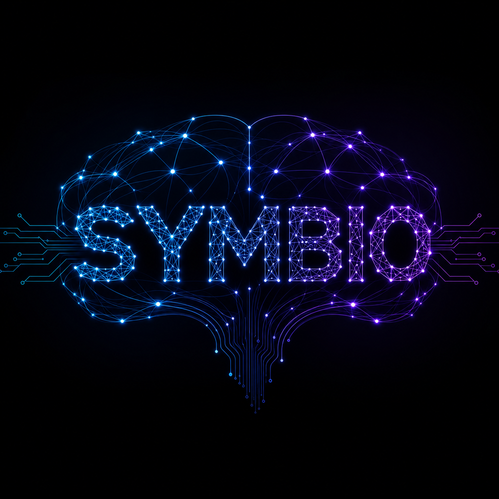
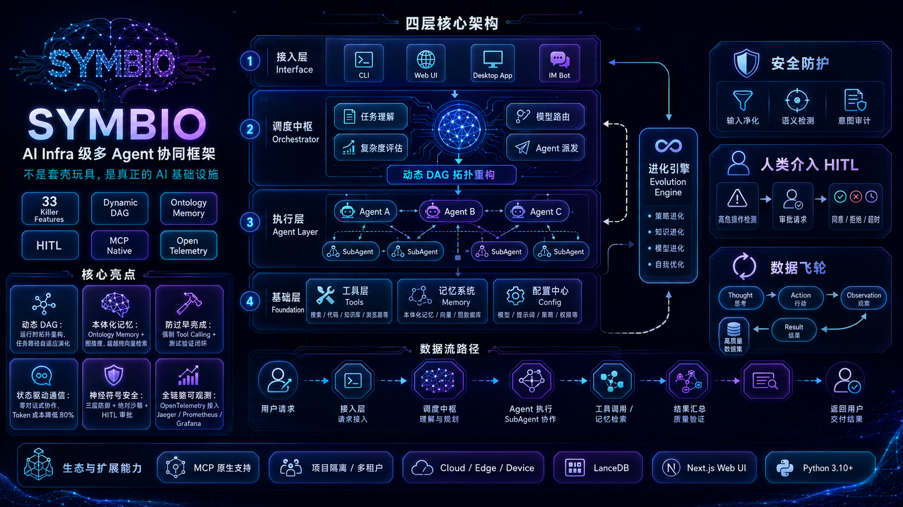

<div align="center">



# SYMBIO

### AI Infra 级多 Agent 协同框架

Symbio 不是一个单纯的 LLM 外壳，而是一套面向真实工程任务的 Agent 基础设施：调度、记忆、审批、沙箱、观测、外部工具接管和数据飞轮都在同一个运行时里协作。

[English](README_en.md) | **中文** | [日本語](README_ja.md)

[](https://opensource.org/licenses/MIT)
[](https://www.python.org/downloads/)
[](https://pypi.org/project/symbio/)

</div>

---

## 项目定位

现在很多 Agent 项目只解决“让模型调用工具”这一层问题。Symbio 关注的是更靠后的工程问题：

- 任务跑到一半失败了，状态怎么恢复？
- Agent 要删除文件、执行代码、调用外部系统时，谁来审批？
- 多个 Agent 协作时，怎么避免互相传话造成成本爆炸？
- 记忆能不能不只是向量检索，而是带结构、关系和可视化的本体图谱？
- Codex、Claude Code 这类现有工具已经在跑，Symbio 能不能接管它们的会话、审计它们的行为？
- 运行轨迹能不能反哺 SOP、评测集、微调数据和 Prompt 优化？

Symbio 的答案是：把 Agent 能力拆成可观测、可审批、可恢复、可验证的基础设施模块。

---

## 架构图



Symbio 当前采用四层架构：

| 层级 | 作用 | 主要模块 |
|------|------|----------|
| 接入层 | 把 CLI、Web UI、外部会话和 IM 审批统一接入 | CLI、FastAPI、Web UI、IM Bot、外部 Agent 控制 |
| 调度中枢 | 任务理解、DAG 编排、模型路由、风险判断 | Orchestrator、DAG Runtime、Router、Planner/Reviewer |
| 执行层 | 多 Agent 执行、SubAgent 协作、工具调用、结果汇总 | BaseAgent、SubAgent、Debate、Execution Store |
| 基础层 | 工具、记忆、配置、安全、观测和进化能力 | Sandbox、Memory、Ontology、HITL、Telemetry、Evolution |

---

## 核心特性

### 1. 动态 DAG 调度

Symbio 不把任务固定成一条静态链，而是把任务拆成可持久化的执行图。执行过程中可以记录节点状态、事件、产物和重规划决策，为失败恢复、任务审计和 UI 可视化提供基础。

相关代码：

- `src/symbio/core/dag_runtime.py`
- `src/symbio/core/dag_orchestrator.py`
- `src/symbio/core/replanner.py`
- `tests/test_dag_runtime.py`

### 2. Planner / Reviewer / Verification 工作流

高风险任务先规划，再审查，再执行。Symbio 内置 workflow policy，用来约束 Agent 不要跳过计划、审批和验证步骤，减少“说完成但没验证”的问题。

相关代码：

- `src/symbio/core/planner_reviewer.py`
- `src/symbio/core/workflow_policy.py`
- `docs/agent-workflow-policy.md`

### 3. 人类审批 HITL

HITL 不是简单弹窗，而是可持久化的审批网关。Symbio 支持 Web、Webhook、QQ/OneBot、企业微信、飞书等审批入口，也支持文本命令：

```text
同意 req-20260609-001
拒绝 req-20260609-001 风险太高
approve req-20260609-001
reject req-20260609-001 too risky
```

审批通过后，Orchestrator 可以从挂起状态恢复；审批拒绝则进入取消或补偿路径。

相关代码：

- `src/symbio/core/hitl_gateway.py`
- `src/symbio/core/hitl_notifier.py`
- `src/symbio/interfaces/api.py`
- `tests/test_hitl_notifier.py`

### 4. 本体记忆与图谱展示

Symbio 的记忆不只是一组向量片段。项目内置 ontology memory，把概念、实体、关系和属性组织成可查询、可展示的图谱。Web UI 可以展示本体节点和关系，帮助用户看到“系统到底记住了什么”。

相关代码：

- `src/symbio/memory/ontology.py`
- `src/symbio/memory/auto_populator.py`
- `web/app.js`

### 5. 模型池与模型路由

Symbio 支持在 CLI 和 Web UI 中配置模型池，并通过任务复杂度、用户配置和模型策略决定路由。对话界面也支持模型选择，避免模型写死在后端配置里。

相关代码：

- `src/symbio/core/router.py`
- `src/symbio/config/settings.py`
- `src/symbio/interfaces/api.py`
- `web/app.js`

### 6. Skills 市场与本地安装记录

Symbio 有独立的 Skill schema、注册表、市场索引和安装记录。当前重点是本地浏览、搜索、导入和安装记录；远程私有仓库、签名校验、依赖安装和沙箱执行还在继续完善。

相关代码：

- `src/symbio/skills/schema.py`
- `src/symbio/skills/registry.py`
- `src/symbio/skills/marketplace.py`
- `tests/test_marketplace_api.py`

### 7. MCP 工具网关

Symbio 已有 MCP stdio JSON-RPC 工具桥接和配置发现能力，目标是让标准 MCP 工具可以被 Agent 统一挂载。当前属于部分实现，后续还需要补连接池、资源协议、鉴权和 UI 挂载。

相关代码：

- `src/symbio/tools/mcp.py`
- `tests/test_mcp_config.py`

### 8. 外部 Agent 会话接管

Symbio 可以登记并控制本地 Codex、Claude Code 等外部 Agent 会话，也支持导入外部 transcript。这个能力适合把现有编码 Agent 纳入统一的审批、沙箱、审计和可视化控制面。

相关代码：

- `src/symbio/tools/external_agents.py`
- `src/symbio/tools/external_transcripts.py`
- `docs/external-agent-control.md`
- `tests/test_external_agents.py`
- `tests/test_external_transcript_import.py`

### 9. Codex 风格沙箱语义

沙箱层支持访问模式、审批策略、权限等级和审计接口。当前已经有本地 sandbox executor、API 和测试；Docker/K8s 级别的强隔离路径已经预留，但生产级网络隔离和 Pod 生命周期管理还需要继续补齐。

相关代码：

- `src/symbio/tools/sandbox.py`
- `src/symbio/tools/k8s_sandbox.py`
- `tests/test_sandbox_runtime.py`

### 10. 可观测性与 Token 成本

Symbio 有 trace、metric、token heatmap、执行事件和 artifact 的接口基础。目标是把每一次 Agent 决策、工具调用、审批、失败和恢复都变成可复盘的数据。

相关代码：

- `src/symbio/core/tracer.py`
- `src/symbio/core/cost_monitor.py`
- `src/symbio/tools/cost_tracker.py`
- `tests/test_capabilities.py`

### 11. 数据飞轮与进化引擎

Symbio 的演进模块围绕轨迹捕获、失败分析、SOP 蒸馏、评测集、数据集导出和微调闭环展开。当前已有数据导出、SOP、eval pipeline 和 API 基础，真实训练后端仍在补。

相关代码：

- `src/symbio/evolution/sop_distiller.py`
- `src/symbio/evolution/dataset_exporter.py`
- `src/symbio/evolution/eval_pipeline.py`
- `src/symbio/evolution/fine_tuner.py`
- `tests/test_evolution_api.py`

---

## 能力账本

项目内置了可运行的能力账本，README、白皮书和 UI 可以用它来区分“已实现、部分实现、规划中”。

| 能力 | 状态 | 说明 |
|------|------|------|
| 动态 DAG 运行时 | 已实现 | 图状态持久化、执行事件、重规划骨架 |
| Planner/Reviewer 策略 | 已实现 | 先规划、风险审查、验证闭环 |
| HITL + IM 审批 | 已实现 | Web、Webhook、QQ/企业微信/飞书文本审批入口 |
| 本体记忆图谱 | 已实现 | ontology memory + API + Web UI 展示 |
| 模型池与模型路由 | 已实现 | 模型配置、路由策略、对话模型选择 |
| 外部 Agent 接管 | 已实现 | Codex / Claude Code 会话登记、运行、导入 transcript |
| Skills 市场 | 部分实现 | 本地市场与安装记录已具备，远程生态待完善 |
| MCP 工具网关 | 部分实现 | stdio JSON-RPC 桥接已具备，协议面待补齐 |
| 沙箱与 K8s 路径 | 部分实现 | 本地沙箱已具备，生产级隔离待加强 |
| OpenTelemetry 可观测 | 部分实现 | trace/token heatmap 基础已具备，部署模板待补 |
| 数据飞轮 | 部分实现 | SOP、导出、eval 基础已具备，训练后端待补 |
| Ray Actor 运行时 | 部分实现 | 本地 fallback 和依赖路径已有，集群调度待产品化 |
| A2A 协议 | 规划中 | 需要 adapter、schema、handshake 和兼容测试 |
| Computer Use Loop | 规划中 | 需要浏览器控制、截图理解、动作规划和审计 |

运行接口：

```bash
curl http://localhost:9090/api/capabilities
```

对应代码：

- `src/symbio/capabilities.py`
- `tests/test_capabilities.py`

---

## 快速开始

### 从 PyPI 安装

```bash
pip install symbio
symbio init
symbio serve --port 9090
```

打开 Web UI：

```text
http://localhost:9090/ui
```

### 从源码开发

```bash
git clone https://github.com/854875058/Symbio.git
cd Symbio
pip install -e ".[dev,server,ml,otel]"
symbio init
symbio serve --port 9090
```

### CLI 示例

```bash
symbio chat "帮我分析这个项目的测试缺口" --model claude-sonnet-4
symbio task list
symbio memory store --title "项目约束" --content "生产环境默认需要人工审批高危操作"
symbio export --format sharegpt --output data/exports/train.jsonl
```

---

## Web UI 能力

当前 Web UI 覆盖了这些主要页面和工作流：

- 对话：会话管理、模型选择、流式回答、历史消息持久化。
- 任务：任务列表、状态、步骤、DAG、执行事件和 artifacts。
- 模型：模型池配置、API Key 保存、连接测试。
- 记忆：记忆搜索、写入、统计、本体图谱展示。
- Skills：本地 Skill、市场浏览、导入、安装记录、文件查看与编辑。
- HITL：审批列表、审批详情、同意/拒绝、IM channel 状态。
- 外部 Agent：Codex / Claude Code session 登记、运行、transcript 导入。
- 沙箱：命令执行、权限策略、审批策略、审计记录。
- 可观测性：trace summary、token heatmap、运行指标入口。
- 能力账本：把项目宣称能力和实际证据放到前端展示。

---

## API 概览

部分核心接口：

| 接口 | 用途 |
|------|------|
| `GET /api/health` | 服务健康检查 |
| `GET /api/capabilities` | 能力账本 |
| `POST /api/chat` | 普通对话 |
| `WS /ws/chat` | 流式对话 |
| `GET /api/tasks` | 任务列表 |
| `GET /api/tasks/{task_id}/dag` | 任务 DAG |
| `GET /api/executions/{execution_id}` | 执行详情 |
| `GET /api/models` / `POST /api/models` | 模型池 |
| `GET /api/memory` / `POST /api/memory/store` | 记忆管理 |
| `GET /api/ontology` | 本体图谱 |
| `GET /api/skills/marketplace` | Skills 市场 |
| `POST /api/hitl/submit` | 提交审批 |
| `POST /api/hitl/im-callback` | IM 审批回调 |
| `POST /api/sandbox/execute` | 沙箱执行 |
| `POST /api/external-agents/sessions/{session_id}/run` | 外部 Agent 执行 |
| `POST /api/export/conversations` | 对话数据集导出 |

---

## 配置

初始化后会生成 `symbio.yaml`。推荐通过 Web UI 或环境变量管理真实密钥，不要把生产 Key 提交进仓库。

最小配置示例：

```yaml
model:
  anthropic_api_key: ""
  anthropic_base_url: "https://api.anthropic.com"
  openai_api_key: ""
  openai_base_url: "https://api.openai.com/v1"
  model_low: "claude-3-5-haiku-latest"
  model_medium: "claude-sonnet-4-20250514"
  model_high: "claude-opus-4-20250514"

server:
  host: "0.0.0.0"
  port: 9090

hitl:
  enabled: true
  high_risk_auto_suspend: true
  approval_timeout: 300
```

---

## 技术栈

| 方向 | 技术 |
|------|------|
| 后端 | Python 3.10+、FastAPI、Typer、Pydantic v2、aiosqlite |
| Agent 调度 | asyncio、DAG Runtime、Planner/Reviewer、Execution Store |
| 记忆 | LanceDB、NetworkX、本体图谱、SQLite 持久化 |
| 工具 | MCP、Sandbox、K8s sandbox path、External Agent adapters |
| 前端 | 原生 Web UI、HTML/CSS/JavaScript、WebSocket |
| 观测 | OpenTelemetry API path、trace summary、token heatmap |
| 扩展 | Ray、Kubernetes、Playwright、LiteLLM、OpenAI、Anthropic |

---

## 文档

| 文档 | 说明 |
|------|------|
| [功能检查表](docs/feature-checklist.md) | 能力实现状态和后续 TODO |
| [架构设计](docs/architecture.md) | 四层架构、安全、HITL、数据飞轮 |
| [模块白皮书](docs/module-design-whitepaper.md) | 模块边界和工程设计 |
| [外部 Agent 接管](docs/external-agent-control.md) | Codex / Claude Code 会话控制 |
| [Agent 工作流策略](docs/agent-workflow-policy.md) | 计划、审查、验证工作流 |
| [PyPI 发布说明](docs/pypi-release.md) | 打包、构建、发布流程 |
| [路线图](docs/roadmap.md) | 分阶段开发规划 |

---

## 开发与验证

```bash
pip install -e ".[dev]"
pytest
```

常用专项测试：

```bash
pytest tests/test_capabilities.py
pytest tests/test_hitl_notifier.py
pytest tests/test_external_agents.py
pytest tests/test_sandbox_runtime.py
pytest tests/test_dag_runtime.py
```

---

## 当前状态

Symbio 仍处于 Alpha 阶段。核心调度、HITL、记忆、外部 Agent 接管、沙箱和 Web UI 已经形成可运行骨架；企业级部署、安全隔离、远程 Skill 生态、完整 MCP 协议面、A2A 和 Computer Use 还在持续实现。

这个 README 会尽量保持一个原则：已经落地的能力写成能力，部分落地的写清缺口，尚未实现的只放在路线图里。

---

## License

MIT License. See [LICENSE](LICENSE).

---

<div align="center">

**Symbio: AI Infra for controllable, observable, evolvable agents.**

</div>
